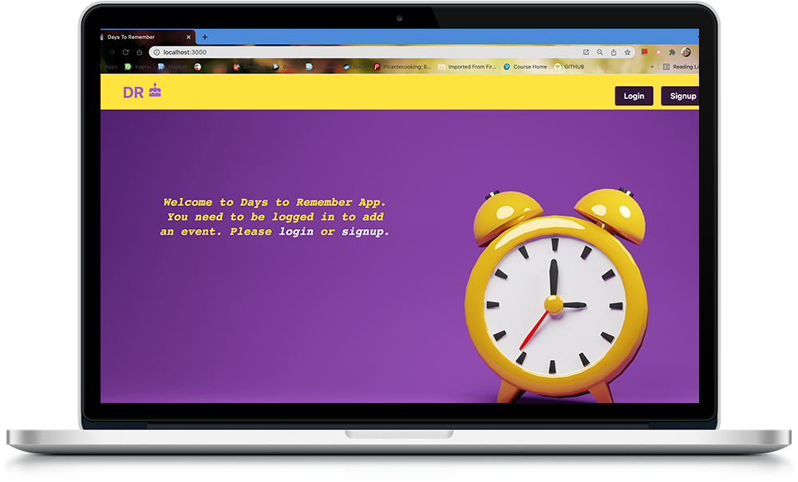
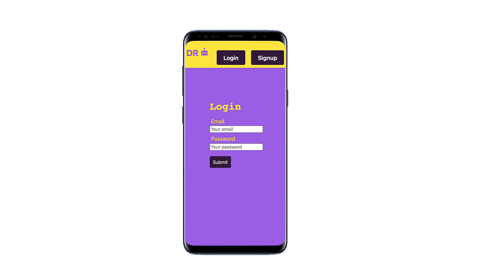
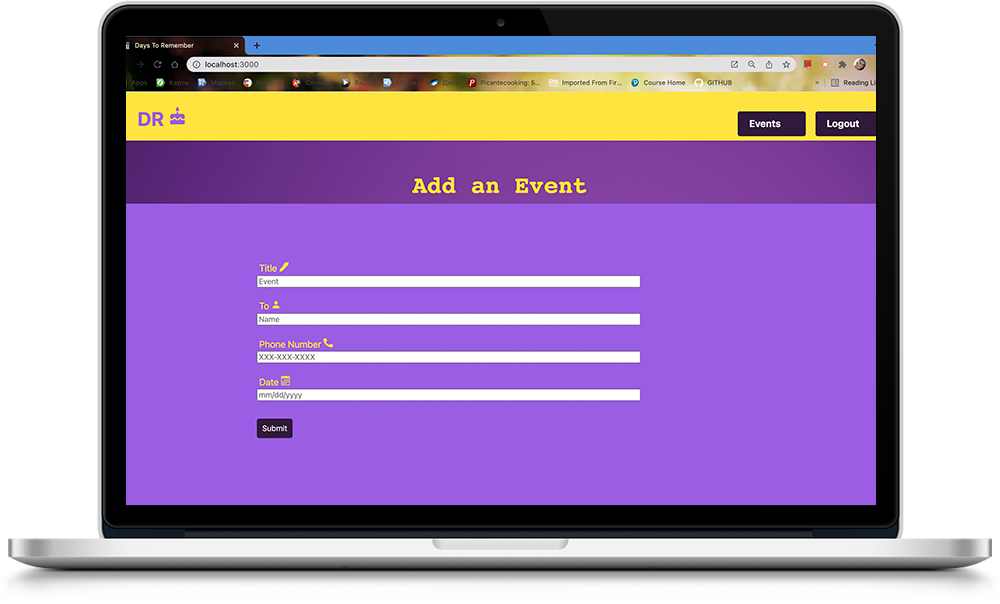
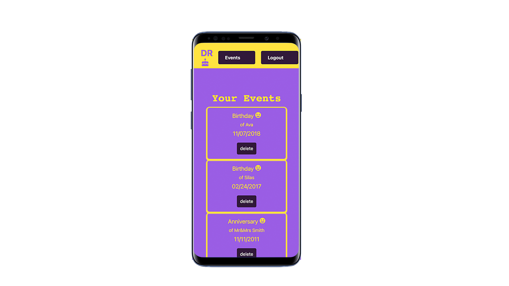

# Days-to-Remember

https://github.com/kabaothao/Days-to-Remember

## Description 
Our app reminds you of your friends' and family's birthdays, anniversaries, and other important dates. It has a simple design focusing on what truly matters. You'll never forget an important day anymore. All you need to do is fill out a form to save a date that you want to remember. 

## Demo 

***

## Table of Contents
* [Technologies used](#technologies-used)
* [Contributions](#Contributions)
* [Credits](#Credits)
* [Contact](#Contact)

## Technologies used
  - JSX
  - CSS
  - Bootstrap
  - API
  - React
  - Node.js
  - Express.js
  - Moment.js
  - JWT
  - GraphQL
  - Mongoose
  - MongoDB
  - Twilio
  - Heroku 

## Contributions
  *Alena Rehberger*

  *David Tierney*

  *Jose Avalos*

  *Kabao Thao*

## Credits
  Thanks to Trilogy Education Services for inspiring us to create this application.

## Contact
If you have any questions, feel free to cantact us at: 
  * https://github.com/kabaothao
  * https://github.com/daveshouse44
  * https://github.com/AlenaReh
  * https://github.com/pepsi1397

Or connect with us on LinkedIn:
  
  * https://www.linkedin.com/in/kabaothao/
  * https://www.linkedin.com/in/david-tierney-652030214/
  * https://www.linkedin.com/in/alena-rehberger/
  * https://www.linkedin.com/in/jose-avalos-892a30101/